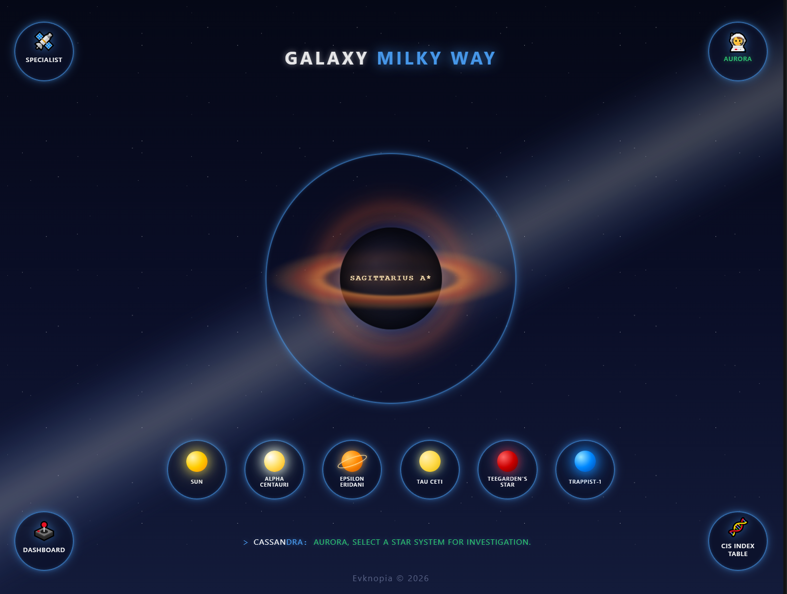
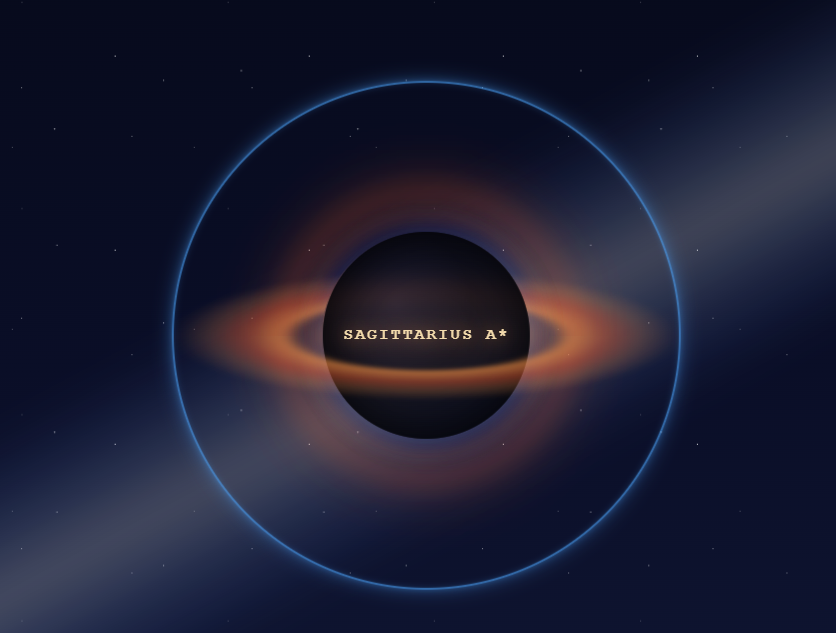
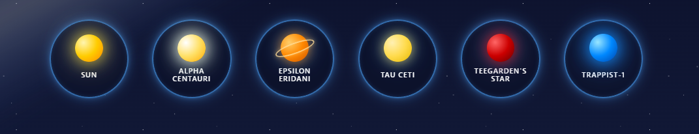

# Galaxu map page — Design & Mockups

## Overview
Интерактивная навигационная карта звездного пространства системы Cassandra. Позволяет оператору выбирать целевые звездные системы, взаимодействовать с объектами и переходить к детальной информации, включая обработку навигационных состояний и ошибок.

## Screenshots

### 1. Начальное состояние — общий вид формы

### 2. Черная дыра Стрелец А — общий вид

### 3. Кнопки звезды — общий вид

