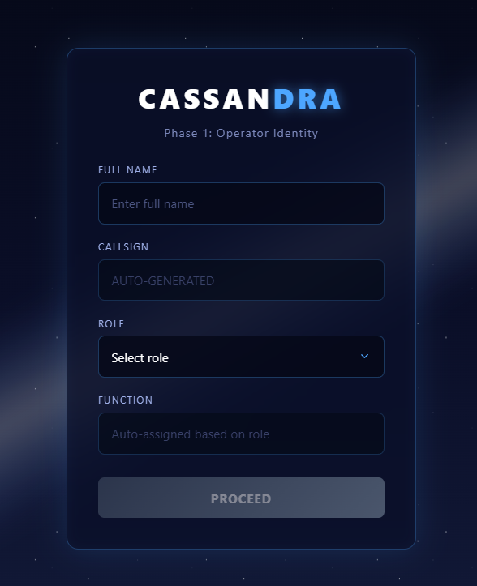
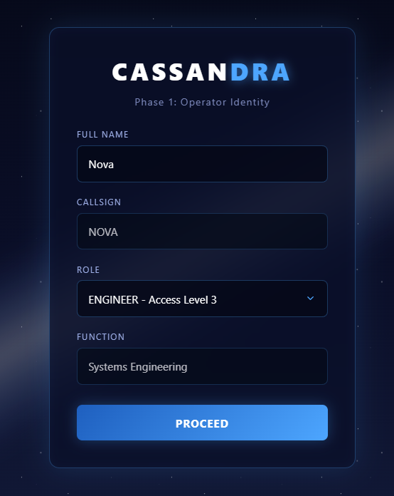
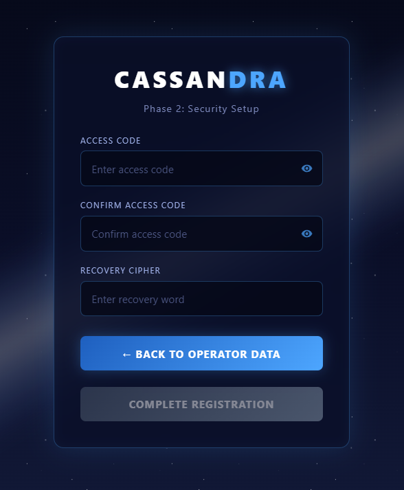
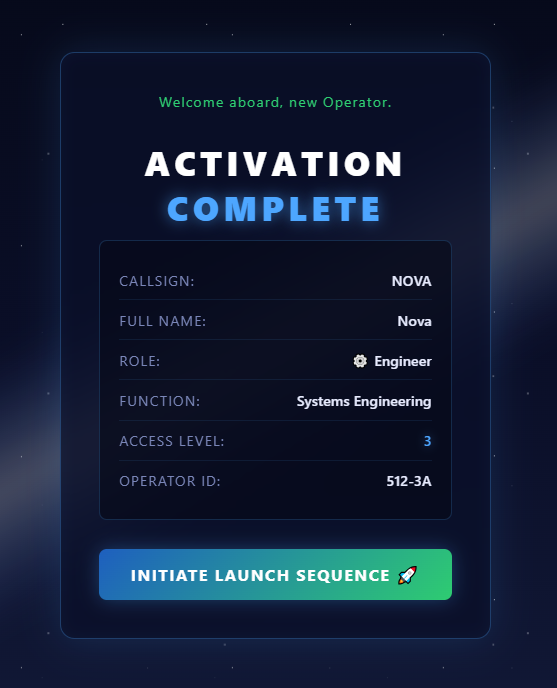
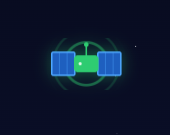

# Sign Up Page — Design & Mockups

## Overview

Многошаговая форма регистрации нового оператора в системе Cassandra. Космическая тематика, строгая клиентская валидация, плавные переходы между тремя шагами (Identity → Security → Confirmation) и декоративная анимация спутника на фоне.

## Screenshots

### 1. Шаг 1: Начальное состояние (Operator Identity)

### 2. Шаг 1: Валидные данные и автозаполнение

### 3. Шаг 2: Настройка безопасности (Security Setup)

### 4. Шаг 3: Протокол подтверждения (Confirmation Protocol)

### 5. Декоративный элемент: Анимация спутника

