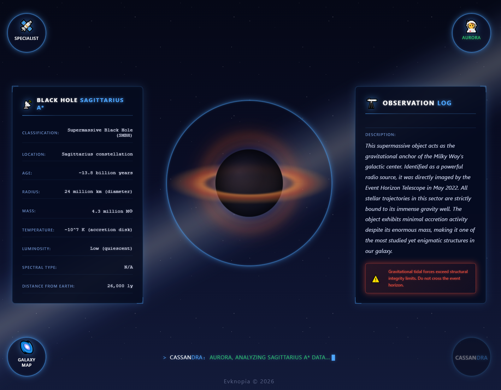
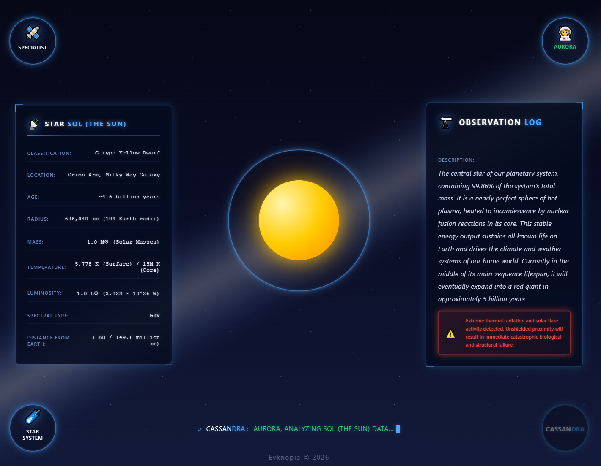
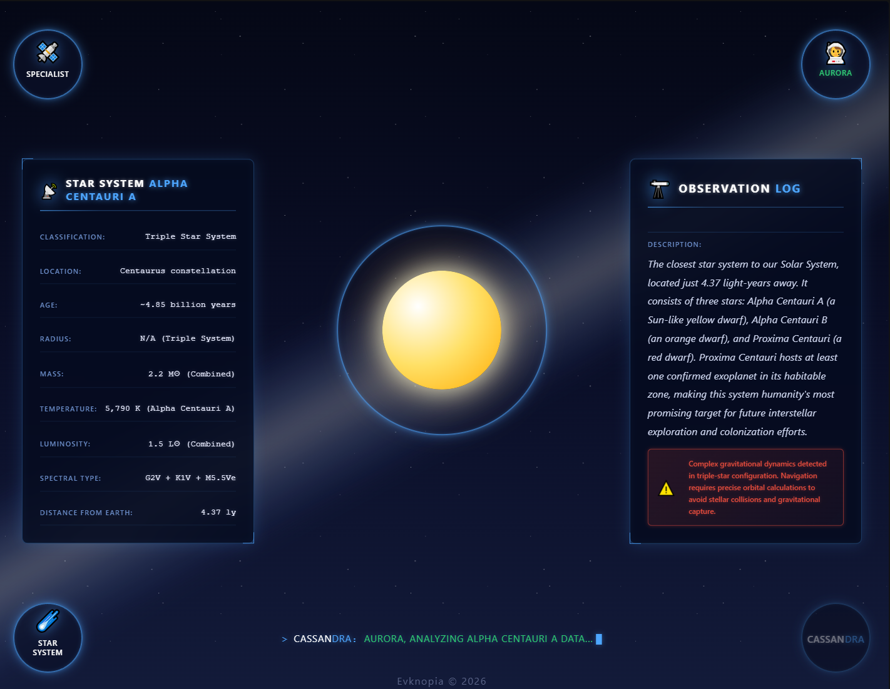
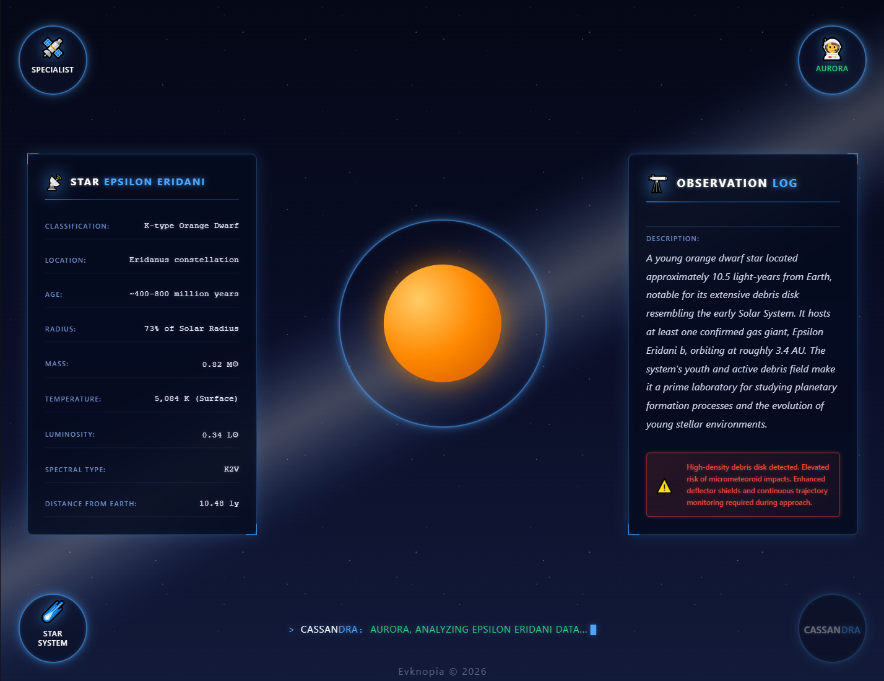
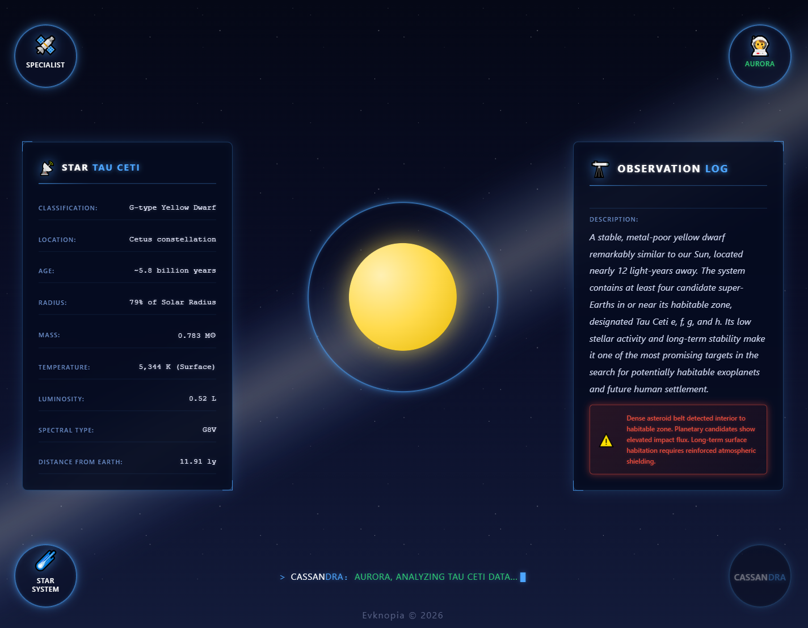
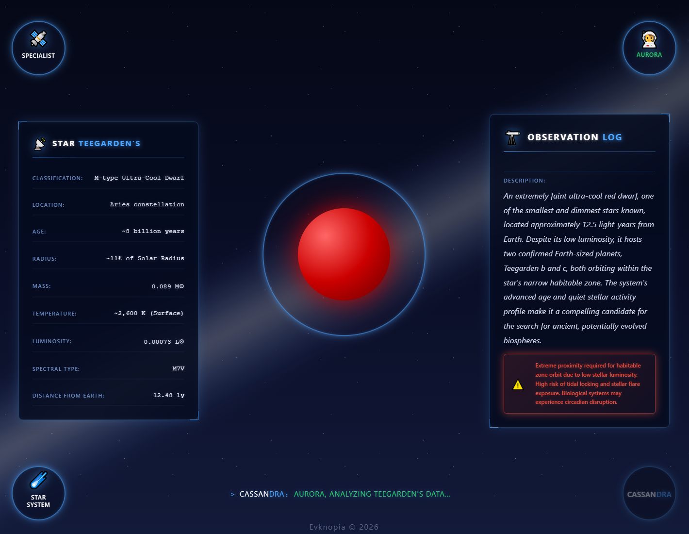
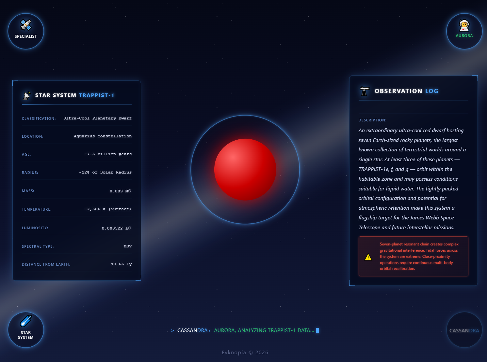

# Star Info page — Design & Mockups

## Overview
Детальная информационная карточка выбранного астрономического объекта в пространстве Cassandra. Позволяет оператору изучать визуальную модель звезды или черной дыры, анализировать её технические характеристики и классификацию в левой панели, а также читать подробное описание в правой панели. Включает отображение системной телеметрии и навигационные переходы к карте галактики или детальной схеме звездной системы.

## Screenshots

### 1. Черная дыра Стрелец А — общий вид формы

### 2. Солнце — общий вид формы

### 3. Альфа центавра — общий вид формы

### 4. Эпсилон Эридана — общий вид формы

### 5. Тау Кита — общий вид формы

### 6. Тигардена — общий вид формы

### 7. Траппист-1 — общий вид формы

