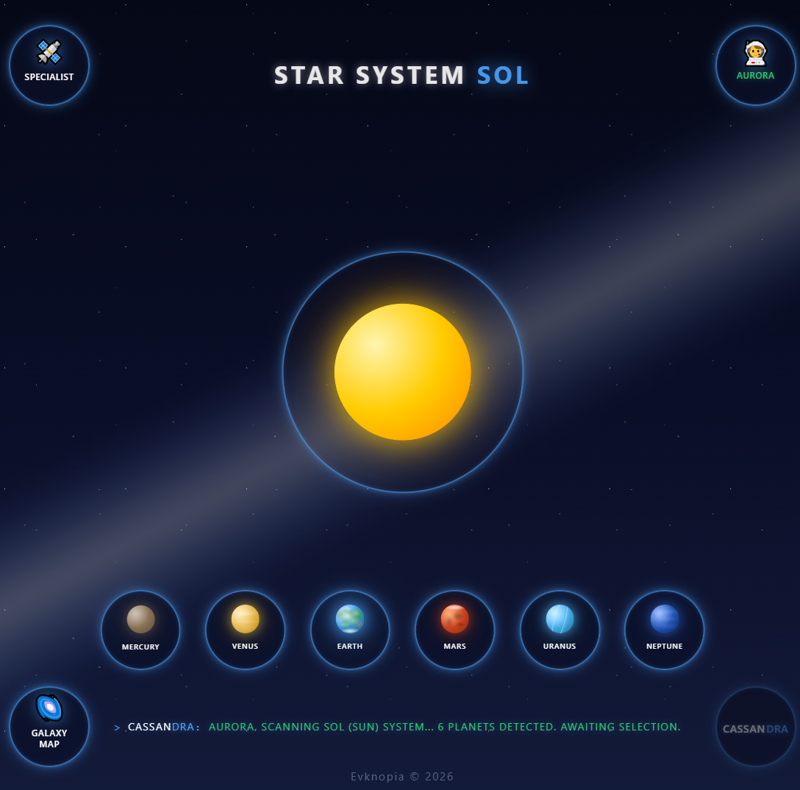
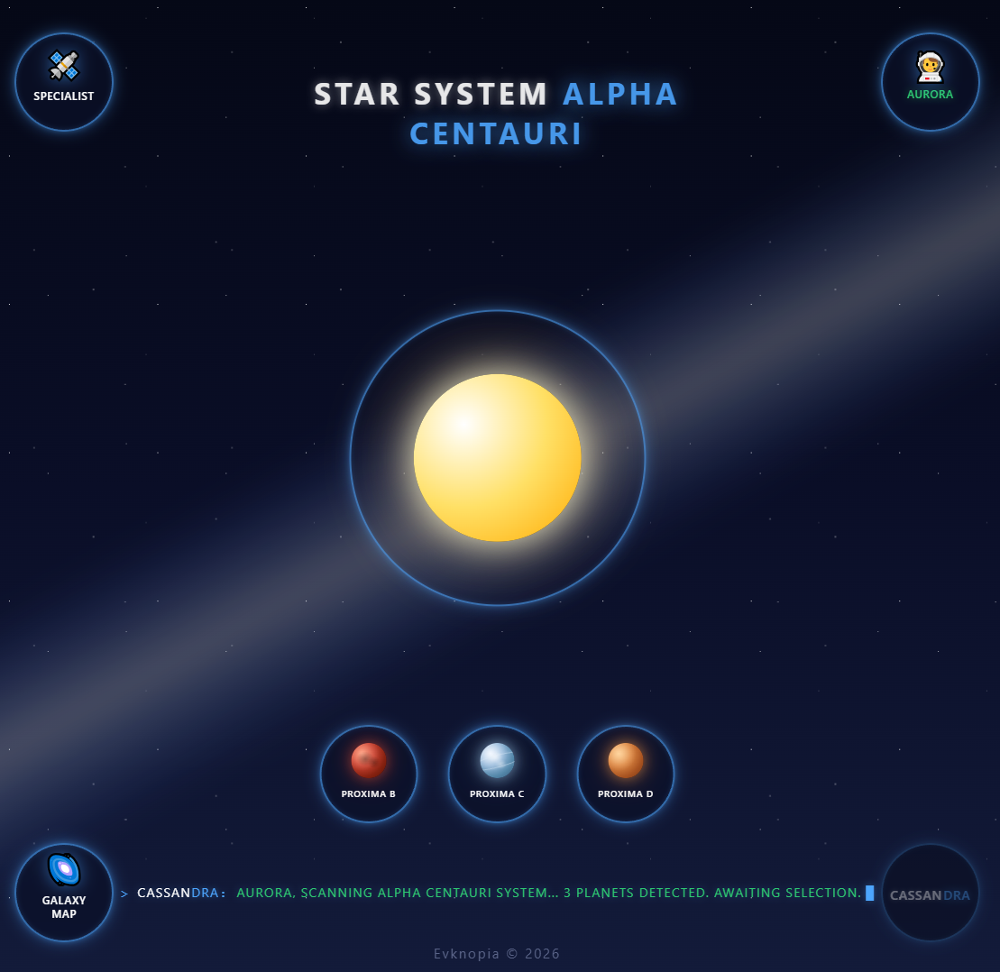
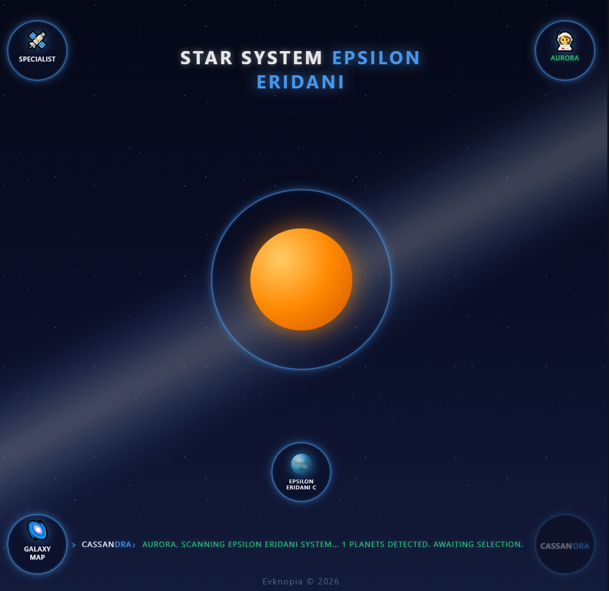
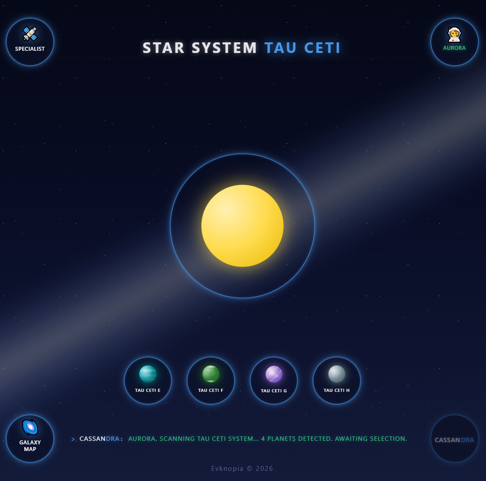
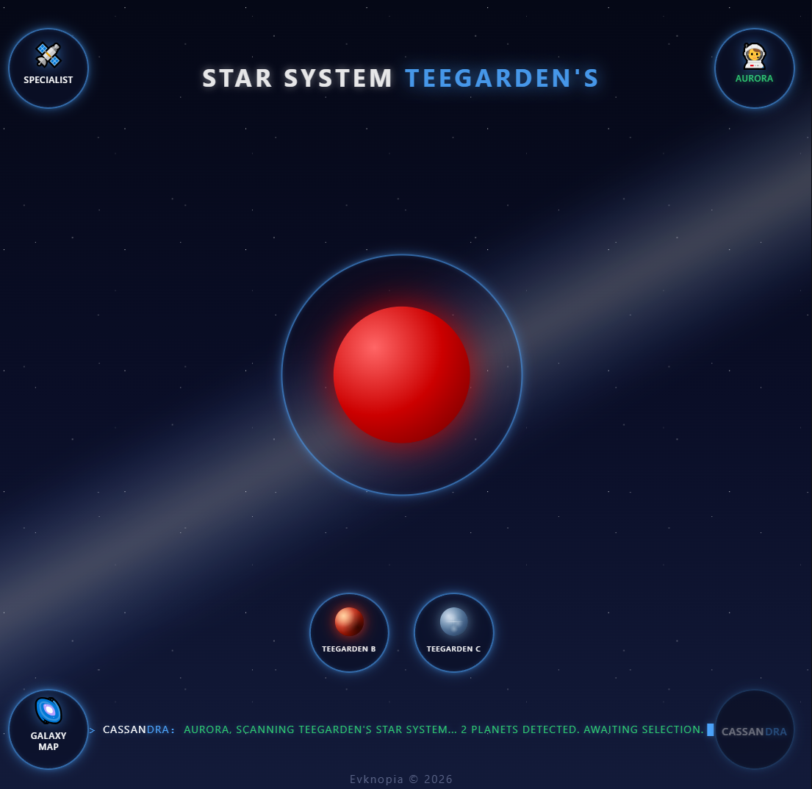
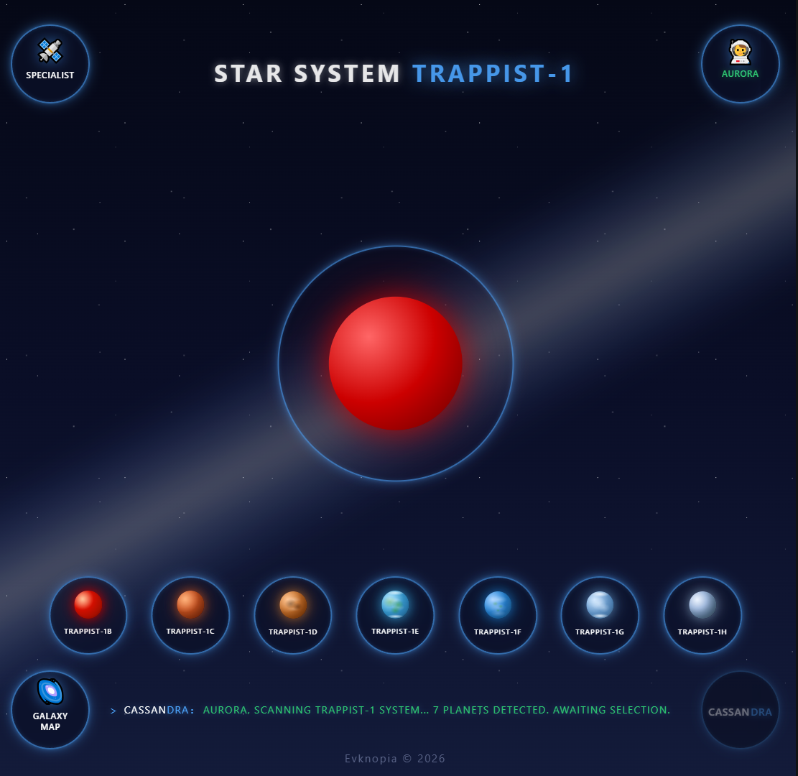

# Star System page — Design & Mockups

## Overview
Детальная визуализация выбранной звездной системы в пространстве Cassandra. Позволяет оператору просматривать центральную звезду и её планетарные спутники, взаимодействовать с панелями телеметрии и переходить к детальному изучению конкретных планет, включая обработку состояний загрузки и навигационных переходов.

## Screenshots

### 1. Солнечная система — общий вид формы

### 2. Альфа Центавра — общий вид формы

### 3. Эпсилон Эридана — общий вид формы

### 4. Тау Кита — общий вид формы

### 5. Тигарден — общий вид формы

### 6. Траппист — общий вид формы

